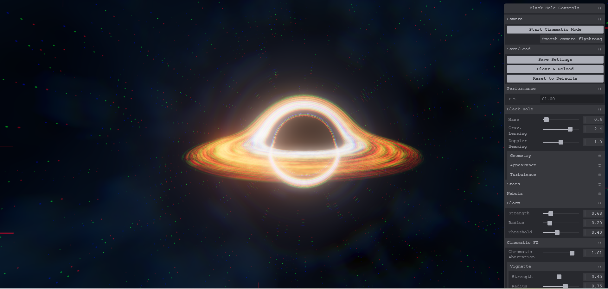

# WebGPU Black Hole

A real-time, physically-inspired black hole renderer built with WebGPU and Three.js TSL — gravitational lensing, a blackbody accretion disk, procedural starfield/nebula, and a cinematic post-processing chain, all running live in the browser at interactive framerates.



**Live demo:** [webgpu-black-hole.vercel.app](https://webgpu-black-hole.vercel.app/)

Built by [Aabidha](https://github.com/Zahraaabidha).

## Features

- **Gravitational Lensing** - Raymarched light bending around a Schwarzschild black hole
- **Accretion Disk** - Temperature-based blackbody coloring with Keplerian differential rotation and adjustable vertical thickness
- **Turbulence Patterns** - FBM noise creates organic arc structures with cyclic animation
- **Procedural Background** - Starfield and nebula clouds generated in the shader
- **Bloom Post-Processing** - HDR bloom for enhanced glow effects
- **Cinematic Color Grading** - Vignette, film grain, and chromatic aberration post-FX chain
- **Background Score** - Royalty-free ambient track with autoplay-safe fade-in
- **Real-time Controls** - Tweakpane UI for adjusting all parameters live

## Requirements

- Browser with WebGPU support (Chrome 113+, Edge 113+)
- GPU with WebGPU capabilities

## Getting Started

```bash
# Install dependencies
npm install

# Start development server
npm run dev

# Build for production
npm run build
```

## Controls

- **Left Mouse Drag** - Orbit camera
- **Right Mouse Drag** - Pan camera
- **Mouse Wheel** - Zoom in/out
- **Right Panel** - Adjust parameters

## Parameters

### Black Hole
- Mass and gravitational lensing strength
- Disk geometry (inner/outer radius, vertical thickness, edge sharpness)
- Disk appearance (temperature, brightness, opacity)
- Turbulence (scale, stretch, rotation speed, cycle time)

### Background
- Star density, size, and brightness
- Nebula layers with independent colors and density

### Post-Processing
- Bloom strength, radius, and threshold
- Vignette strength/radius/softness
- Film grain amount and grain size
- Chromatic aberration strength

## Technical Details

The simulation uses a raymarching approach to trace light paths through curved spacetime around a Schwarzschild (non-rotating) black hole. Key techniques:

- **Adaptive light bending** integrated step-by-step along the ray near the event horizon
- **Analytic disk-plane intersection** with a slab-thickness approximation for a visually "thick" disk, rather than an infinitely thin plane
- **Cyclic time crossfade** prevents differential rotation from winding turbulence indefinitely
- **Blackbody radiation** lookup-table approximation for physically-motivated disk colors
- **Cinematic post-FX chain** (`postfx.js`) — chromatic aberration via offset per-channel texture sampling, vignette via radial smoothstep falloff, and film grain via time-varying hashed noise — applied after bloom, before final output

## Project Structure

- `main.js` — entry point, renderer/scene setup, config persistence, post-processing wiring
- `blackhole.js` — uniform management and mesh setup for the raymarching shader
- `blackhole-shader.js` — the TSL raymarching shader itself (lensing, disk, stars, nebula)
- `postfx.js` — cinematic post-processing chain (vignette, grain, chromatic aberration)
- `audio.js` — autoplay-safe background music loader/player with fade-in
- `ui.js` — Tweakpane controls
- `camera-animation.js` — cinematic camera flythrough system
